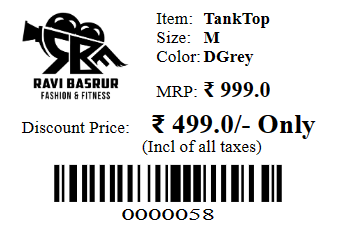

# 🧾 Billing Management System  
The **Billing Management System** is a desktop application developed using **Python** and **SQLite**. It streamlines the process of generating bills, managing customer data, and tracking payments. This project is a great learning resource for understanding **desktop GUI development, database integration, and CRUD operations**.

## 🌟 **Key Features**  
- 📑 **Bill Generation**: Generate detailed customer bills with itemized product details.  
- 🧍 **Customer Management**: Add, update, delete, and manage customer records.  
- 📦 **Product Management**: Add, update, delete, and manage product details.  
- 📊 **Sales Reports**: View daily, weekly, or monthly sales reports.  
- 🔐 **User Authentication**: Secure login system for authorized access.  
- 💾 **Data Persistence**: Uses **SQLite** to store customer, product, and transaction data.  

## 🌟 **Technologies Used**  
- 💻 **Programming Language**: Python  
- 🖥️ **GUI Library**: Tkinter (or mention any other library like PyQt or Kivy if applicable)  
- 🗄️ **Database**: SQLite (for data storage and management)  


## Screenshot
- **Main Screen**
    - The main screen of the application is where the user will get option to login as admin or as an employee.
    

- **Employee Login**
    - The employee can login using their employee id and password, One standout feature of the application is that the employee can only login if the admin has created an account for them and also the password is encrypted, ensuring the security of the employee's account.
    

- **Admin mode**
    - The admin can login using the default username and password, which is "admin01" and "admin01" respectively.
    
    - List of things the admin can do:
        - Inventory Management
        - Employee Management
        - Invoice Management
        - Settings

- **Inventory Management**
    - The admin can search, add, update, delete and genrate barcode stickers for the products.
    
    - Update Product
    

- **Employee Management**
    - The admin can search, add, update and delete the employee's account.
    
    - Add Employee
    

- **Invoice Management**
    - The admin can search invoices and generate bills and sales reports.
    
    - Sales Report
    

- **Billing Screen**
    - The employee can generate bills for the customers.
    

- **Barcode Sticker**
    - The admin can generate barcode stickers for the products.
    

## Installation
- Clone the repository
    ```bash
    git clone https://github.com/mahadev0811/BilledIn.git
    ```

- Install the required packages
    ```bash
    pip install -r requirements.txt
    ```

- Run the application
    ```bash
    python app.py
    ```

    <h2>📬 Contact</h2>

Feel free to reach me through the below handles if you'd like to contact me.

[](https://www.linkedin.com/in/Krunal-patil-074432281)
[](https://www.instagram.com/kunal._.patil18)

---
Made with ❤️ by krunal patil  


